+++
date = '2026-09-14T11:00:00+02:00'
draft = false
title = 'Converting an old laptop motherboard into a true rack-mounted server'
images = ['images/rack.jpg']

translationKey = 'laptop-to-rack-mounted-server'
+++

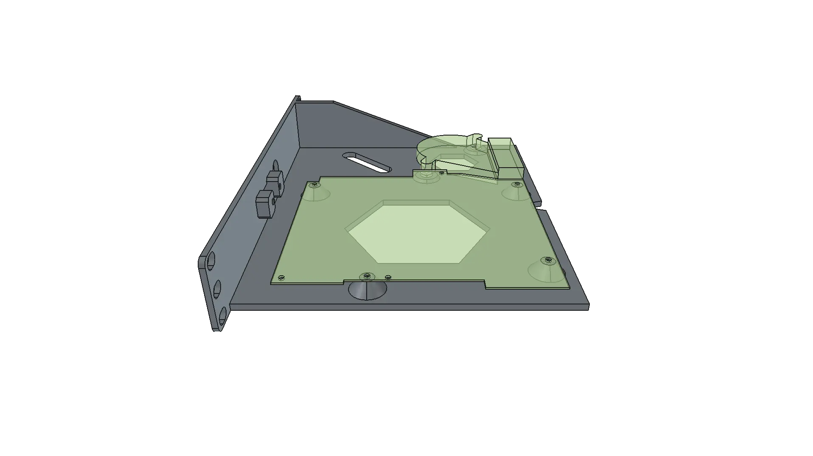

I’ve had an old Acer Aspire ES1-523 laptop sitting around for a while. I had previously been playing with it, experimenting with FDE and using it as a server, but I didn’t particularly like having to leave it half-open in a corner. I decided to convert it into a proper 10-inch rack-mounted server by 3D-printing a purpose-built enclosure designed to fit into a [Lab Rax](https://the-diy-life.com/introducing-lab-rax-a-3d-printable-modular-10-rack-system).

This turned out to be considerably more involved than simply designing a box around a PCB. Over the course of about a month, I ended up combining hardware reverse engineering, CAD, microsoldering, and 3D printing into one rather satisfying project.

## TLDR

Jump to the [final result.](#the-enclosure)\
Jump to the [downloads section.](#downloads)

## Hardware specs

This laptop turned out to be surprisingly fit for the project. Not only is the motherboard extremely compact, but it also provides good expansion options, power efficiency, and decent processing power. The relevant hardware is:

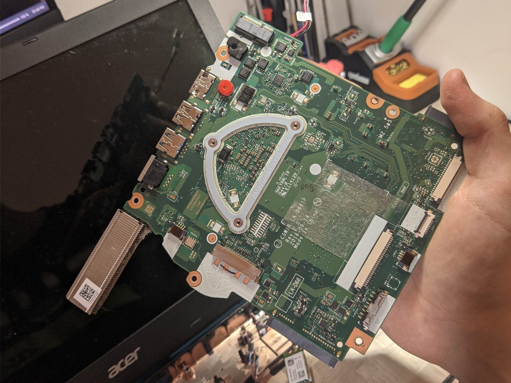

- Aspire ES1-523_108A_V1.02 (TRICERA_CZL V1.02 board)
- AMD A8-7410 APU
- 2x DDR3L SO-DIMM memory slots, 8 GB installed, 16 GB documented maximum capacity at 1600 MHz
- 2x SATA connectors (one of which is Slimline SATA)
- Integrated RTL8111G-family Gigabit Ethernet controller
- M.2 2230 Key-E slot, originally used by the wireless adapter, carries actual PCIe lines, very interesting for future expansion
- Other ports
    - 1x USB 3.0, 1x USB 2.0
    - 1x USB 2.0, 1x SD card reader, 1x 3.5 mm jack on a separate daughterboard
    - 1x HDMI

## Reverse engineering the power button

Before designing anything, I had to answer a more fundamental question: could I actually operate the motherboard once it was removed from the laptop? The original power button is part of the laptop's chassis, so simply removing the keyboard and putting the motherboard in a rack enclosure would leave me without an obvious way to turn it on.

I therefore reverse engineered the relevant circuit directly on the motherboard, starting from the keyboard FPC connector. By probing the connector pins and checking their behaviour, I found that pin 28 is ground, and pin 27 carries the power button signal. Momentarily shorting pin 27 to ground was enough to turn the laptop on.

I then traced the signal back to the ENE KB9022Q D, a QFP-128 embedded controller on the other side of the board: pin 27 on the FPC connector maps to pin 114 on the ENE EC.

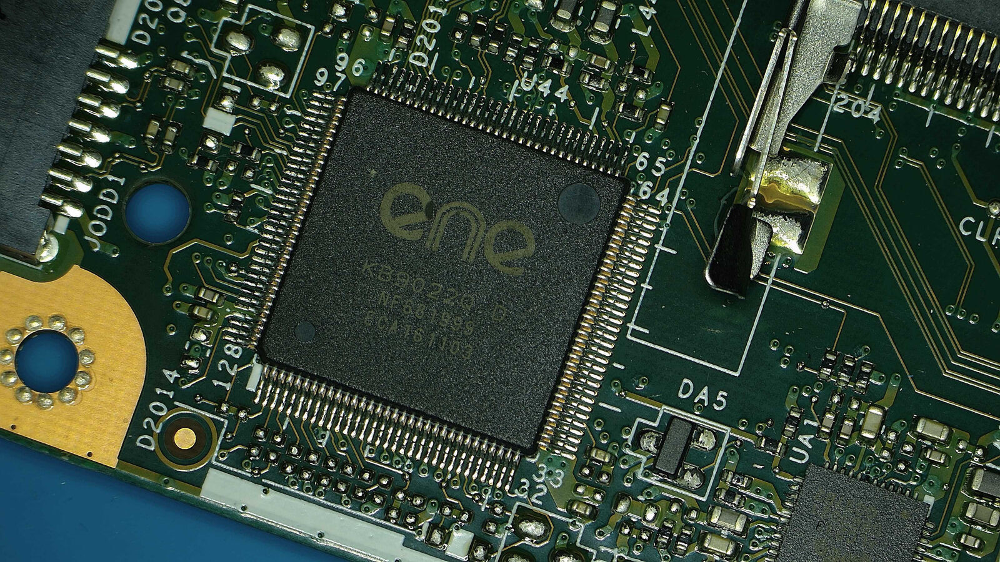

Interestingly, I only found [the motherboard's electrical documentation](c5w1r-la-d661p-rev-1.02-schematic-diagram.pdf) after completing the reverse engineering myself. The schematic explicitly confirms both the FPC connection and the function of the relevant EC pin, which was a particularly satisfying way of validating the measurements.

Doing it manually was nevertheless worthwhile. Apart from confirming how the button worked, tracing the signal around the board allowed me to look for a more convenient soldering point for the new enclosure. I eventually determined that the only readily accessible exposed points I could use on this net were the EC pin 114 and the FPC connector pin 27. The latter was therefore the most practical place to tap the signal.

I decided that the new enclosure would use a conventional 16 mm momentary push button with a blue LED ring, which also meant rerouting the stock power LED's signal.

## Tapping the motherboard

This meant some fairly delicate soldering directly on the motherboard. I used 0.1 mm enamelled copper wire to pick up both the power button and power LED signals and route them to the new front panel.

The original LED (LED 2) was actually an SMD dual-color LED, with a blue channel for normal power-on indication, and an orange channel that I believe is used for some kind of sleep-status indication. I used a hot-air station to remove the SMD LED before I could tap into the blue channel.

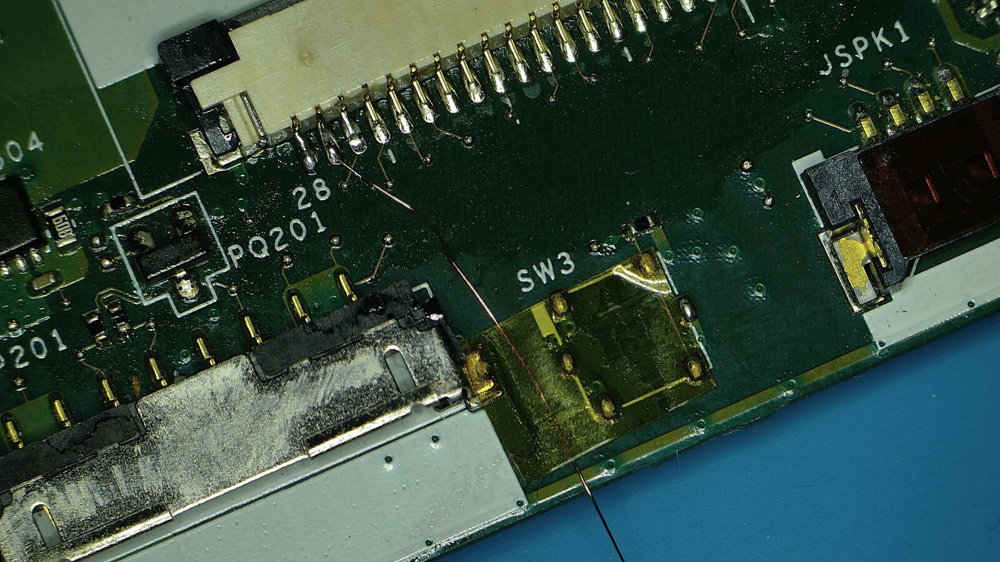
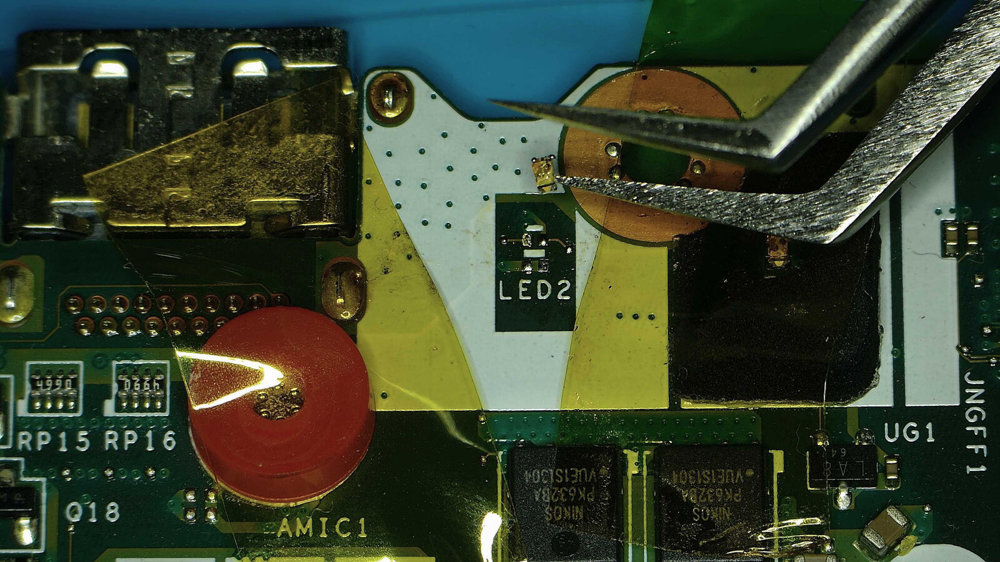

## Measuring the mounting holes

Getting accurate mounting-hole positions was surprisingly annoying.

My first attempt was to scan the motherboard with a flatbed scanner. Unfortunately, the holes appeared slightly oval because of parallax, and they were out of focus, making the scan unsuitable for directly extracting their centers. I also tried using a phone camera positioned parallel to the board. Despite using a zoom lens from as far away as possible, lens distortion was still too prominent, making that image unusable as well.

Eventually, I found a much simpler solution: I placed a sheet of paper underneath the motherboard, and I used a mechanical pencil with its tip extended further than normal to trace the hole outlines onto the paper.

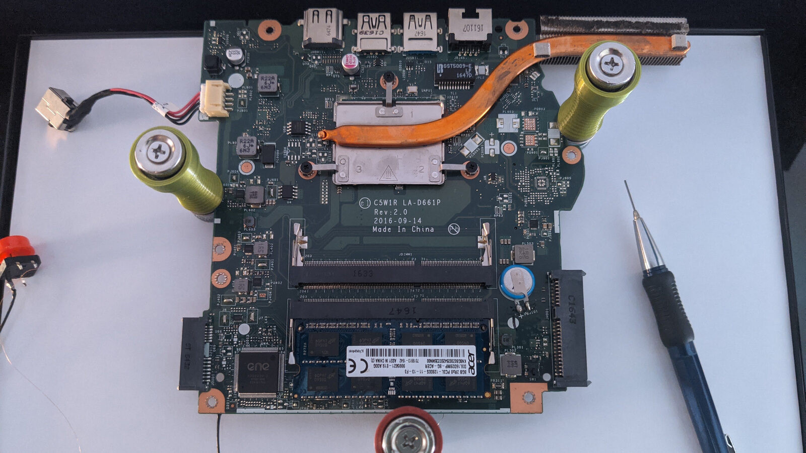

I then scanned the result, imported it into Inkscape and used the known diameter of the mounting holes to establish the scale. To verify accuracy, I compared a few known distances. For instance, Inkscape measured 108.109 mm, while the actual distance was 108.16 mm. That was more than accurate enough for this application.

Using a Python macro, I could then extract the hole centers and transfer them into FreeCAD.

## Creating the motherboard mechanical reference in FreeCAD

With the mounting-hole positions sorted out, I could finally start building the motherboard model in FreeCAD.

I deliberately didn't try to reproduce the entire motherboard in three dimensions. For the enclosure design, I mainly needed the things that could actually affect the mechanical design: the PCB outline and thickness, mounting holes, connector locations, and the heatsink. I also modelled the fan mounting points and its position relative to the motherboard.

The mounting plane of the motherboard became the reference plane for the model. This made it much easier to reason about mounting-boss heights and component clearances. I also made the important dimensions parametric where possible. 

After creating the motherboard's mechanical reference, I printed its outlines and mounting-hole pattern onto paper and placed the motherboard over it as a final sanity check. It was a very low-tech verification of a fairly high-tech workflow. The holes lined up almost perfectly.

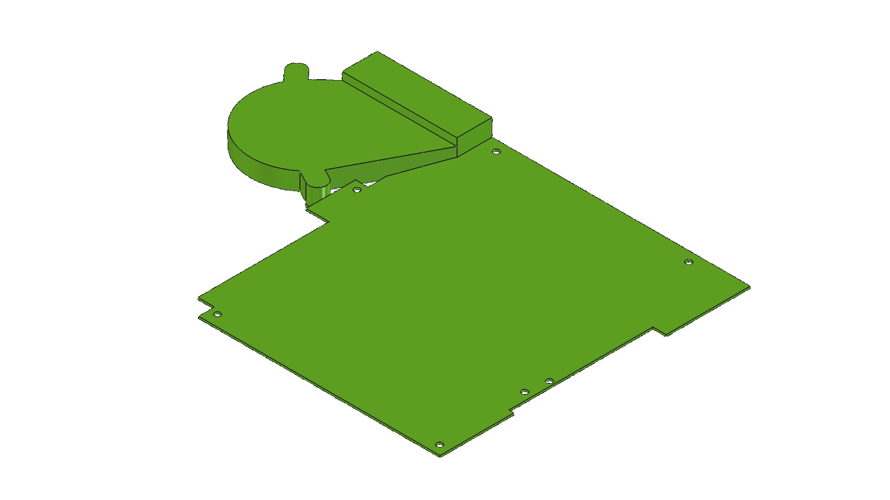

## Designing for the 10-inch server rack

The next step was fitting the motherboard into an actual rack enclosure rather than simply putting it inside a box.

The target was the [Lab Rax](https://the-diy-life.com/introducing-lab-rax-a-3d-printable-modular-10-rack-system), a 10-inch 3D-printable rack system. It uses the most commonly accepted 10-inch server rack dimensions, so I had a fairly well-defined envelope to work within, particularly the distance between mounting posts and the available 1U height.

I wanted the result to look like an actual piece of rack equipment rather than a motherboard that happened to be screwed to a shelf. This meant that the enclosure, front panel and rear I/O all had to be designed together.

I initially planned to have all the I/O accessible from the front. I later realized that would have made for a rather messy front panel and wouldn't have really fit the look I was going for. I eventually decided to rotate the I/O to the back and leave just the 16 mm power button and a USB 3.0 port on the front.

The USB port was brought to the front using an extension cable that could be screwed in from inside the enclosure. This meant there were no visible fasteners around the connector, giving the front panel a much cleaner, almost factory-like appearance.

## Designing the enclosure

The enclosure itself ended up being fairly simple, but there were a few details worth getting right.

The motherboard is mounted on several printed bosses, with the boss heights based on the measurements I took from the original laptop. I used tapered geometry around the bosses rather than making them simply tall cylinders. This provided some additional support while also making them easier to print in different orientations. They are designed to accept M2.5 x 5 x 3.5 brass heat-set inserts.

I also added two structural supports between the front panel and the horizontal shelf on the left side. I later realized the shelf was sufficiently rigid without both of them, so I removed the second support. This also made cable management easier.

I considered using a honeycomb pattern to reduce the amount of material and potentially improve airflow. In the end, I decided against it because most of the motherboard's weight is concentrated towards the right side. I did, however, create two hexagonal pockets: one around the fan intake and another underneath the APU area.

Finally, I added a long slot for routing cables through the shelf, particularly the SATA cable. After removing the second structural support, I moved the slot further to the left and elongated it because the previous iteration was too short to accommodate the 22-pin SATA cable.

Before publishing the final model, I also added a notch below the Ethernet port. This makes it much easier to press the clip on the Ethernet connector and unplug the cable.

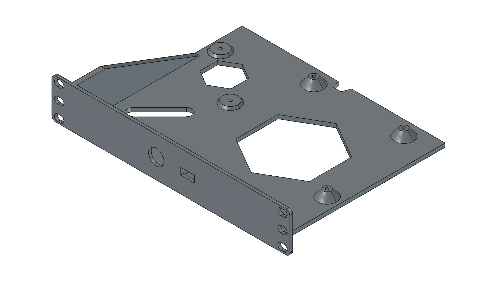

## Quick printing tests

Before committing to the full enclosure, I did a few quick test prints of the parts where I wasn't completely confident about the fit.

The first useful test was a small section containing some of the motherboard and fan mounting bosses. This was much faster and cheaper than discovering a clearance problem several hours into a full enclosure print.

And, of course, I found one. One of the motherboard mounting bosses collided with the fan. I removed that boss from the design, since there were already enough mounting points to hold the motherboard securely.

These small tests were particularly useful for checking things that are difficult to judge from the CAD model alone. FDM tolerances, the actual fit of connectors and the physical relationship between components can all be slightly different from what you expect on screen.

## The final print

Once I was happy with the design, I printed the complete enclosure in JAYO black matte PETG on my Creality Ender 3 V3 KE.

My 220 mm build plate meant I had to print the enclosure vertically, with the front panel lying on the print bed at a 45-degree angle. The enclosure is fairly tall, so I wasn't particularly interested in pushing print speeds. I used [a conservative profile](#downloads) and a brim to keep the part firmly attached to the build plate, especially considering the printer's tendency to wobble due to the top-mounted spool. I will probably move the spool to a separate roller at some point.

The print itself was largely uneventful, which is the best possible outcome after all the time spent designing it. I did get some artifacts towards the top of the print, probably because I somehow managed to accidentally wrap the filament around the vertical post of the spool holder. The fact that the whole print succeeded despite that is actually quite impressive.

There was, however, one more small issue. During assembly, I discovered that one of the motherboard mounting bosses interfered with the Slimline SATA connector. Fortunately, it wasn't a major problem: I simply cut a small notch into the boss with a knife to make enough clearance for the connector.

I then updated the CAD model to remove that boss entirely. There was no reason to keep a mounting point that was only getting in the way, and this meant [the published model](#downloads) would reflect the version I actually wanted to use.

This is also why doing physical test prints is valuable. Even with a fairly detailed mechanical model, there are always a few interactions that are much easier to spot when you have the actual hardware sitting in front of you.

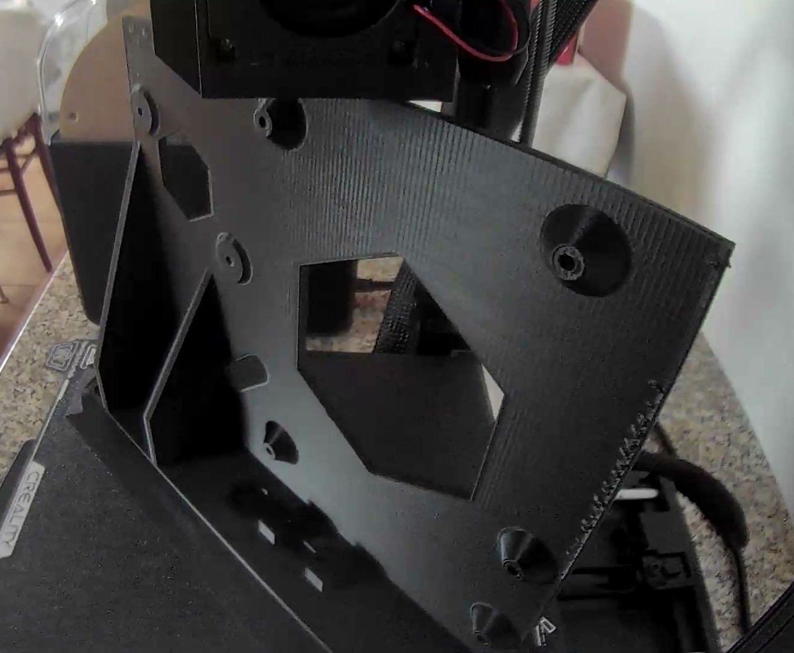

## The finished server

With the final enclosure printed, I could finally install the motherboard, fan, front-panel controls and wiring.

Everything fit as intended, including the motherboard mounting points, I/O openings and front-panel components. The power button and USB port also ended up looking much cleaner than the original plan of exposing all of the laptop's I/O on the front.

The result is a rather convincing little rack server built around what was originally just an old laptop motherboard.

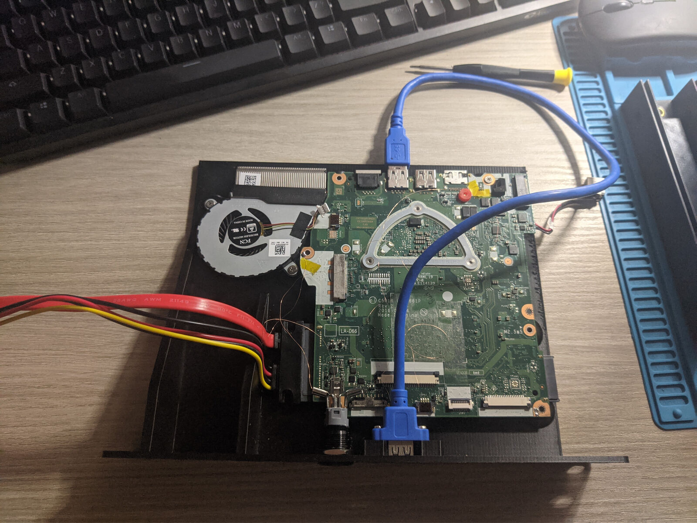

## The enclosure

I then moved on to printing the Lab Rax. I used the heat-set insert version.

Due to my relatively small print bed, I had to adapt the horizontal edges by splitting them into two parts. I found some models online which did the same thing, but they were all designed for the nuts-and-bolts version of the Lab Rax. I therefore [designed my own split version](#downloads) taking inspiration from one of those models.

I also printed a few other panels, including [a very interesting design](#downloads) consisting of a 1U panel with two modular subunits: modularity inception! This allowed me to use the left half to mount my SSD and the right half to add a decorative grid, resulting in a rather nice visual effect.

I left an additional 1U space in the rack, which will eventually host my next custom enclosure for a network switch motherboard. I'll probably work on that one soon.

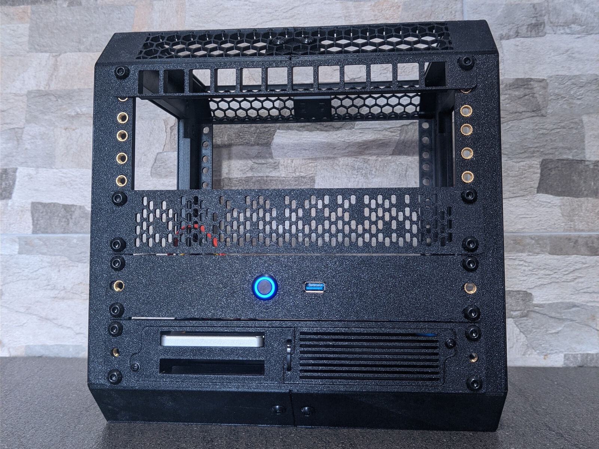

## Conclusions

This project ended up being much more interesting than I initially expected. The 3D printing was really only the final manufacturing step. Most of the work was in figuring out how everything had to fit together, both electrically and mechanically.

What I particularly enjoyed about this project was how many different skills had to come together to make it work. I had to combine electronics and hardware reverse engineering to understand the motherboard and power button circuit; microsoldering to add the new front panel connections; programming to process measurements and automate parts of the CAD workflow; CAD design to build the mechanical reference and enclosure; and finally 3D printing to turn the design into an actual piece of hardware.

I also learned that a useful mechanical model doesn't necessarily have to be a perfect digital replica of the hardware. As long as the important interfaces are represented accurately (mounting holes, connectors, component clearances, and so on), everything else can be simplified considerably.

In the end, the project was a nice demonstration of how much can be done by combining a few different disciplines. What started with an old laptop motherboard eventually turned into a custom piece of rack-mounted hardware, built around a combination of reverse engineering, electronics, software and mechanical design.

And perhaps most importantly, it actually looks like something that belongs in a rack.

## Downloads

- FreeCAD mobo reference and enclosure project [[FCStd Direct](mobo-reference-and-enclosure.FCStd)]
- Enclosure 3D model [[STL Direct](acer-aspire-es1-523-10inch-enclosure.stl)] [[3MF Direct](acer-aspire-es1-523-10inch-enclosure.3mf)]
- Lab Rax heat-set insert split horizontal edge\
Solid [[Pins STL Direct](horizontal-edge-solid-pins-side.stl)] [[Holes STL Direct](horizontal-edge-solid-holes-side.stl)]\
Ventilated [[Pins STL Direct](horizontal-edge-ventilated-pins-side.stl)] [[Holes STL Direct](horizontal-edge-ventilated-holes-side.stl)]\
Original inspiration [[Makerworld](https://makerworld.com/it/models/2452007-lab-rax-10-server-rack-5u-for-a1-mini)]
- 10-inch split panels [[Printables](https://www.printables.com/@yurymkomarov/collections/1458415)]
